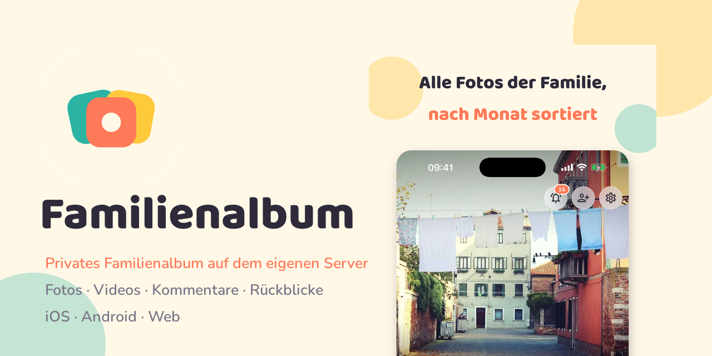
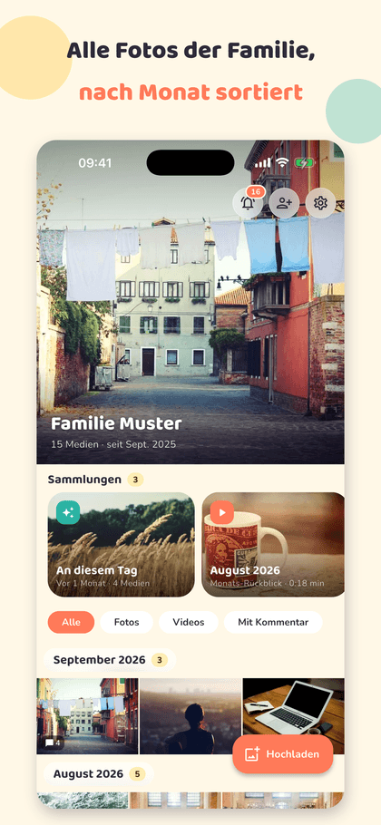
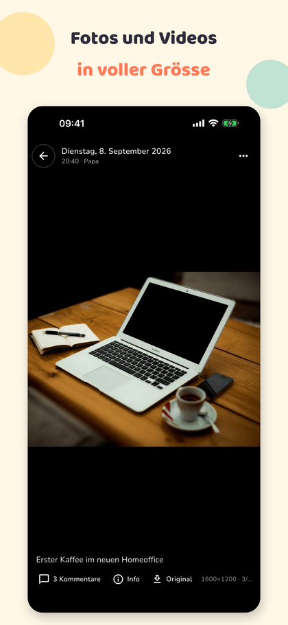
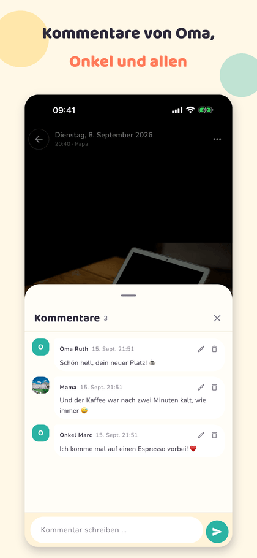
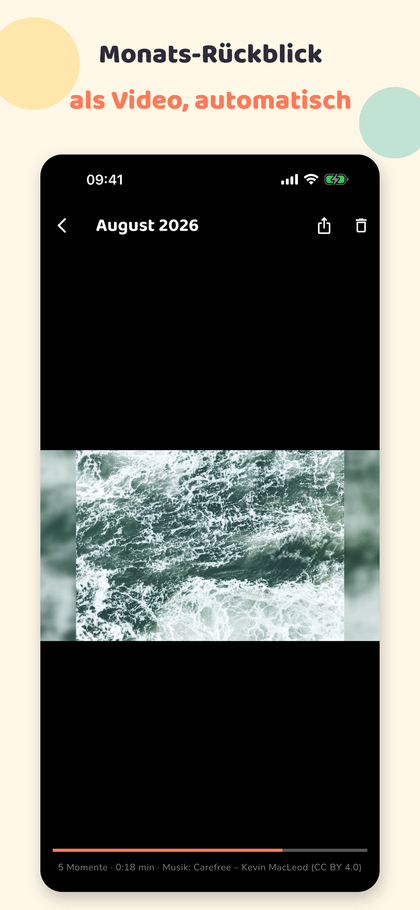
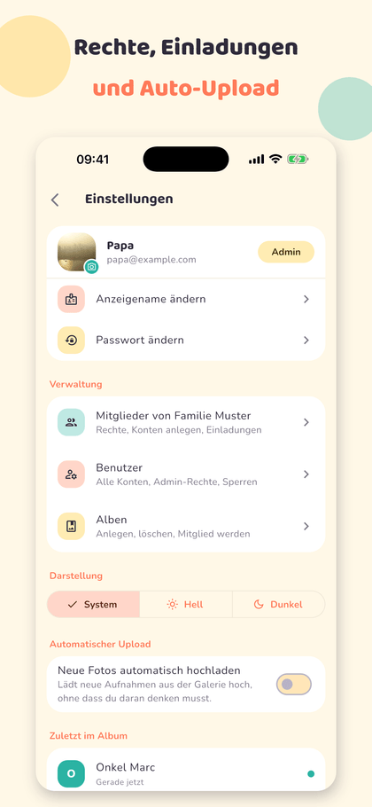

# Familienalbum

🇩🇪 Deutsch · [🇬🇧 English](./README.en.md)



Privates, selbst gehostetes Familienalbum (nach dem Vorbild von FamilyAlbum/Mitene). Fotos und Videos werden von
Familienmitgliedern hochgeladen, chronologisch nach Aufnahmedatum angezeigt, kommentiert und bei Bedarf als Original
gesichert. Läuft als Docker-Compose-Stack zu Hause, von aussen über einen Reverse-Proxy (Traefik, Caddy) oder
Cloudflare Tunnel erreichbar.
Clients: iOS, Android, Web (ein Flutter-Codebase). Projekt-Brief und Konventionen: [CLAUDE.md](./CLAUDE.md).

**Status: Version 1.1.** Server im Dauerbetrieb, iOS-App im App Store, Android-App über Google Play oder APK,
Web-App im Browser. Oberfläche auf Deutsch und Englisch, je nach Systemsprache. Änderungen siehe [CHANGELOG.md](./CHANGELOG.md). Lizenz: [MIT](./LICENSE).

| Timeline | Foto | Kommentare | Rückblick | Einstellungen |
|---|---|---|---|---|
|  |  |  |  |  |

*Beispielfotos von picsum.photos, Demo-Familie.*

## Funktionen

- **Familien und Rechte:** mehrere Familien pro Server, Beitritt nur per Einladungslink, Rechte pro Mitglied
  (Hochladen, Original laden, Kommentieren, Familien-Admin), globale Admins verwalten Benutzer und Familien in der App.
- **Timeline:** Mosaik nach Monaten, Vollbild mit Wischen und Zoom, Videos mit Spulen, Mehrfachauswahl zum Löschen
  oder Datum anpassen, Hell/Dunkel wählbar.
- **Upload:** in Chunks, wiederaufnehmbar, Duplikat-Erkennung per SHA-256, HEIC/HEIF und iPhone-Videos werden
  serverseitig umgewandelt; Auto-Upload neuer Aufnahmen im Hintergrund (iOS, Android).
- **Aufnahme-Metadaten:** Kamera, Objektiv, Blende, Belichtung, ISO, Brennweite, Aufnahmeort mit Karte;
  Aufnahmedatum einzeln oder für eine Auswahl setzen bzw. verschieben.
- **Kommentare und Aktivität:** Kommentare pro Medium, Glocke mit Ungelesen-Zähler, Verlauf nach Tagen
  (wer hat wann hochgeladen oder kommentiert, mit Sprung zum Foto).
- **Originale:** direkt in der App in die Fotos-Mediathek sichern oder teilen, im Browser herunterladen.
- **Rückblicke:** Monats- und Jahres-Video sowie Sekunden-Film, vom Server mit ffmpeg gebaut (Kamerafahrt,
  Überblendungen, Titelkarte, lizenzfreie Musik mit Nachweis), automatisch am Monatsersten und per Knopf;
  «An diesem Tag» zeigt Fotos vom selben Kalendertag früherer Monate und Jahre.
- **Export:** alle Fotos, Videos und Kommentare als ZIP, gesamt oder pro Monat, mit `index.json` und Kommentaren
  als Datei – die Datenhoheit, die kommerzielle Dienste verweigern.
- **Profil:** Profilbild pro Benutzer, sichtbar bei Kommentaren, Aktivität und Mitgliedern; Kommentare bearbeitbar
  (Autor, Familien-Admin oder globaler Admin); «Zuletzt im Album» zeigt, wer wann zuletzt da war.
- **Timeline-Filter:** Alle · Fotos · Videos · Mit Kommentar.
- **Push** (Firebase Cloud Messaging): Sammelmeldung bei neuen Uploads, sofort bei Kommentaren, Meldung bei
  fertigen Rückblicken; ohne Firebase fragen die Clients regelmässig nach.
- **Design «Kinderbuch»:** warme Vanille, Koralle, Lagune, Sonne; Baloo 2 und Nunito, gebündelt.

## Aufbau

```
apps/api    Fastify-Backend + Medien-Worker (Node 22, TypeScript, Prisma, Zod, BullMQ, sharp, ffmpeg)
apps/app    Flutter-App (iOS, Android, Web)
infra       docker-compose.yml, Caddyfile, .env.example, backup.sh
docs        API-Übersicht, ADRs, iOS-Build, generierte OpenAPI-Spezifikation
```

| Teil | Technik |
|---|---|
| Backend | Node 22, Fastify 5, Prisma 6, Zod 4, BullMQ 6, sharp, fluent-ffmpeg |
| Datenbank / Queue | PostgreSQL 16, Redis 7 |
| Medien | Dateisystem-Bind-Mount, Thumbnails als WebP (400/1600), Video-Preview als H.264 MP4 |
| Auth | E-Mail + Argon2id, JWT-Access-Token (15 min) + Refresh-Token mit Rotation (30 Tage) |
| Clients | Flutter (Riverpod, go_router, Dio) |
| Auslieferung | Caddy serviert Web-App und proxied `/api`; davor Traefik/Reverse-Proxy oder Cloudflare Tunnel |

## Betrieb (Docker Compose)

Die Images baut GitHub Actions bei jedem Push auf `main` und bei jedem Release-Tag
(`.github/workflows/images.yml`) und veröffentlicht sie in der GitHub Container Registry:

- `ghcr.io/pendraga/familienalbum-api` – API und Worker (Node, ffmpeg, libheif)
- `ghcr.io/pendraga/familienalbum-web` – Flutter-Web-Build, ausgeliefert von Caddy

Der Server zieht nur fertige Images. Ein Stack-Manager wie Dockhand oder Portainer braucht lediglich
`infra/docker-compose.yml` und die Variablen aus `infra/.env.example`; alle Werte werden per Variablen-Ersetzung
in die Container gereicht, eine `.env` neben der Compose-Datei ist optional.

### Einrichten

1. Registry-Zugang nur nötig, falls die Pakete privat sind (GitHub-Token classic mit `read:packages`):

```bash
docker login ghcr.io -u <github-benutzer>
```

2. Variablen setzen (Stack-Manager) oder `.env` anlegen:

```bash
cd infra && cp .env.example .env
```

Pflicht: `POSTGRES_PASSWORD`, `JWT_SECRET` (mindestens 32 Zeichen, `openssl rand -base64 48`), `ADMIN_EMAIL`,
`ADMIN_PASSWORD`, die Pfade `MEDIA_PATH`, `POSTGRES_PATH`, `REDIS_PATH` sowie `HTTP_PORT` (Standard 8090, Port 80 ist
auf Unraid/Synology meist belegt). `IMAGE_TAG` wählt die Version (`latest`, `v1.0.0`, `sha-<commit>`).
`OPERATOR_NAME` und `OPERATOR_EMAIL` erscheinen auf der Datenschutzseite `/datenschutz.html` als verantwortliche Stelle.

3. Starten. Die API spielt beim Start die Migrationen ein und reiht hängengebliebene Medien erneut ein:

```bash
docker compose up -d
```

4. Ersten Admin anlegen (idempotent):

```bash
docker compose exec api node dist/seed.js
```

5. Im LAN unter `http://<server>:<HTTP_PORT>` anmelden, Album anlegen, Einladung verschicken.

### Einladungen

Ein Album-Admin erzeugt unter Mitglieder → «Einladungscode erzeugen» einen Code (7 Tage, eine Nutzung) und teilt ihn
als Link `https://<domain>/invite?code=…&server=…`. Der Link öffnet die Web-App mit vorbelegtem Server und Code, prüft
die Einladung sofort und bietet «In der App öffnen» (URL-Schema `familienalbum://`). Damit der Link auf dem Handy
direkt die App öffnet (Universal Links / App Links), nimmt `tool/build.sh` die Domain aus `APP_LINK_DOMAIN` in
`apps/app/firebase.env`: iOS bekommt sie in die Release-Entitlements, Android in den Manifest-Platzhalter. Der
Web-Container liefert die nötigen Dateien unter `/.well-known/` aus; dort die eigene Team-ID (iOS) und die
Fingerabdrücke der Signaturschlüssel (Android, Upload- und Play-Schlüssel) eintragen. Wechselt die Domain, `API_BASE_URL`
anpassen und beide Apps neu verteilen; bis dahin landet ein Link auf der neuen Domain in der Web-App mit «In der App öffnen».

### Zugriff von aussen

Cloudflare-Tunnel-Token in die Variablen und den Stack mit Profil starten:

```bash
docker compose --profile tunnel up -d
```

Alternativ ein vorhandener Reverse-Proxy mit HTTPS vor Caddy; er muss Request-Bodys bis 50 MB durchlassen (Chunks).

### Update, Backup, Selbstbau

```bash
docker compose pull && docker compose up -d
```

Backup täglich per Cron mit `infra/backup.sh` (`pg_dump` + `rsync` der Medien). Ohne Registry aus dem Git-Checkout bauen:

```bash
docker compose -f docker-compose.yml -f docker-compose.build.yml up -d --build
```

### Push (Firebase Cloud Messaging)

Optional. Ohne Konfiguration pollen die Clients jede Minute.

1. Firebase-Projekt anlegen, iOS-App (Bundle-ID `ch.familienalbum.familienalbum`) und Android-App (gleicher Paketname)
   hinzufügen; für iOS den APNs-Schlüssel (.p8 aus dem Apple-Developer-Konto) in Firebase unter Cloud Messaging hochladen.
2. **Server:** Dienstkonto-Schlüssel (JSON, Firebase → Projekteinstellungen → Dienstkonten) in den Secrets-Ordner legen
   (`SECRETS_PATH`, Standard `./secrets` neben der Compose-Datei; bei Dockhand/Portainer absolut setzen) und
   `FIREBASE_SERVICE_ACCOUNT=/run/secrets/<datei>.json` setzen, danach `docker compose up -d`. Ist der Schlüssel
   unbrauchbar, startet die API trotzdem – ohne Push, mit dem Grund im Log.
3. **App:** Werte aus den Firebase-Projekteinstellungen in `apps/app/firebase.env` eintragen (Vorlage
   `firebase.env.example`, je ein API-Key und eine App-ID für iOS und Android) und mit `apps/app/tool/build.sh ipa|apk`
   bauen – das Skript setzt die `--dart-define`s. Ohne `firebase.env` startet die App ohne Firebase und pollt.
   `APP_LINK_DOMAIN` in derselben Datei ist die Domain für Universal/App Links. `API_BASE_URL` belegt optional die
   Server-Adresse im Login vor, sinnvoll nur für Builds einer einzelnen Familie, nicht für Store-Builds.
   Die Push-Berechtigung (`aps-environment`) liegt in `ios/Runner/Runner.entitlements`; Xcode aktiviert die Capability
   über das automatische Signing selbst.
4. **Rückblick-Musik:** Beim Image-Build werden zehn lizenzfreie Stücke von Kevin MacLeod (incompetech.com, CC BY 4.0)
   geladen; der Nachweis steht im Abspann jedes Videos. Eigene MP3s in `MUSIC_PATH` (Standard `<Medien>/_music`) haben Vorrang.
5. **Google Play (interner Test):** Erstes Bundle von Hand in der Play Console hochladen (`apps/app/tool/build.sh appbundle`
   → `build/app/outputs/bundle/release/app-release.aab`). Danach automatisiert: in der Play Console unter
   Einrichtung → API-Zugriff einen Service-Account mit der Rolle «Releases verwalten» anlegen, dessen JSON-Schlüssel
   als `apps/app/android/play-service-account.json` ablegen (nicht im Git) und mit `node apps/app/tool/play_upload.mjs`
   hochladen (`--track=internal|alpha|beta|production`, `--notes="…"`).
6. **TestFlight ohne Xcode-Organizer:** In App Store Connect unter Benutzer und Zugriff → Integrationen →
   App Store Connect API einen Team-Schlüssel (Rolle «App-Manager») anlegen, die `.p8`-Datei nach
   `~/.appstoreconnect/private_keys/AuthKey_<KEY_ID>.p8` legen und Schlüssel- und Issuer-ID in `apps/app/ios/asc.env`
   eintragen (Vorlage `asc.env.example`, nicht im Git). Danach: `apps/app/tool/build.sh ipa && node apps/app/tool/testflight_upload.mjs --notes="…"`
   lädt hoch, wartet auf Apples Verarbeitung, setzt die Testhinweise und hängt den Build an die TestFlight-Gruppe
   (`ASC_GROUP` in `asc.env`, `--group=…`).
   Der IPA-Export braucht das Verteilungs-Zertifikat aus Apples Cloud: entweder ist Xcode mit der Apple-ID angemeldet,
   oder ein zweiter API-Schlüssel mit Rolle «Admin» steht als `ASC_SIGNING_KEY_ID` in `asc.env`; dann exportiert
   `tool/build.sh ipa` über die API, unabhängig vom Xcode-Konto. `ITSAppUsesNonExemptEncryption=false` in der Info.plist erspart die Verschlüsselungsfrage.
7. **App-Store-Eintrag per Skript:** `node apps/app/tool/asc_listing.mjs --screenshots` setzt Untertitel, Kategorie,
   Datenschutz-URL, Beschreibung, Keywords, Support-URL, die TestFlight-Beschreibung und lädt die Screenshots aus
   `apps/app/store/ios/<DISPLAY_TYPE>/` hoch (6,7" und 6,5" für iPhone; die App ist nur für iPhone freigegeben).
   Texte stehen im Skript, persönliche Angaben (Server, Kontakt, Copyright, Demo-Konto) in `ios/asc.env`. Das Passwort
   des Demo-Kontos für Apples Prüfer wird in App Store Connect von Hand eingetragen.
8. **Android-APK:** Release-Schlüssel einmalig anlegen (siehe `apps/app/android/key.properties.example`), dann
   `apps/app/tool/build.sh apk` → `build/app/outputs/flutter-apk/app-release.apk` zum direkten Verteilen. Der Schlüssel
   muss für alle künftigen Versionen derselbe bleiben (Backup!). Hinweis SDK 2026: `flutter_secure_storage` verlangt
   API 37, das SDK liefert die Plattform aber nur als `android-37.0`; AGP 9.1 sucht `android-37` – Ordner kopieren und in
   `source.properties` `AndroidVersion.ApiLevel=37` setzen.

## Entwicklung (Backend)

Voraussetzungen: Node 22, Docker (PostgreSQL, Tests), `ffmpeg`/`ffprobe` im PATH.

```bash
npm install
```

```bash
docker run -d --name familienalbum-pg -p 5432:5432 -e POSTGRES_USER=familienalbum -e POSTGRES_PASSWORD=familienalbum -e POSTGRES_DB=familienalbum postgres:16-alpine
```

```bash
cp apps/api/.env.example apps/api/.env
```

```bash
npm run prisma:migrate -w apps/api && npm run seed -w apps/api && npm run dev
```

Swagger-UI: <http://localhost:3000/api/docs> · Health: <http://localhost:3000/api/v1/health>

Medienverarbeitung lokal mit `MEDIA_PROCESSING=inline` im API-Prozess (kein Redis nötig). Produktionsnah: Redis
starten (`docker run -d --name familienalbum-redis -p 6379:6379 redis:7-alpine`) und `npm run dev:worker -w apps/api`.

| Skript (in `apps/api`) | Zweck |
|---|---|
| `npm test` | Vitest + Testcontainers (PostgreSQL 16), rund 210 Integrationstests; `npm run test:unit` ohne Docker |
| `npm run typecheck` | `tsc --noEmit` |
| `npm run openapi` | schreibt `docs/openapi.json` |
| `npm run prisma:migrate` | Migration aus Schema-Änderungen erzeugen und anwenden |
| `npm run seed` | ersten Admin anlegen (`ADMIN_*` aus `.env`) |

API-Beschreibung: [docs/api.md](docs/api.md). Entscheidungen: [docs/adr](docs/adr).

## Entwicklung (Flutter-App)

Voraussetzungen: Flutter SDK (stable, aktuell 3.47), für iOS ein Mac mit Xcode ([docs/ios-build.md](docs/ios-build.md)).

```bash
cd apps/app && flutter pub get
```

Web gegen das lokale Backend (Server-URL ist auch im Login-Screen editierbar):

```bash
cd apps/app && flutter run -d chrome --dart-define=API_BASE_URL=http://localhost:3000
```

Vom Handy im WLAN testen (LAN-IP des Rechners einsetzen; Release-Build ist deutlich flüssiger):

```bash
cd apps/app && flutter build web --release --pwa-strategy=none --dart-define=API_BASE_URL=http://<lan-ip>:3000 && node tool/serve_web.mjs 8090
```

`--pwa-strategy=none` verhindert, dass Safari alte Builds aus dem Service-Worker-Cache lädt. Ohne `API_BASE_URL`
nimmt die Web-App den eigenen Origin (so läuft sie hinter Caddy). iOS-Build gegen den Heim-Server:

```bash
cd apps/app && flutter run --release -d <iphone> --dart-define=API_BASE_URL=https://<deine-domain>
```

Branding: Quelle ist `apps/app/assets/branding/logo.svg`; Icons und Splash neu erzeugen mit
`node tool/render_branding.mjs && dart run flutter_launcher_icons && dart run flutter_native_splash:create`.

### Auto-Upload

In den App-Einstellungen unter „Automatischer Upload“ einschalten. Neue Aufnahmen (ab Einschaltzeitpunkt, Datum
rückwirkend wählbar) werden in die gewählte Familie hochgeladen, standardmässig nur im WLAN.

- Vordergrund: beim Start, bei Rückkehr in den Vordergrund (höchstens alle 5 Minuten) und über „Jetzt“.
- Hintergrund: Android WorkManager (periodisch), iOS BGTaskScheduler (`ch.familienalbum.autoupload`). Pro Lauf höchstens 25 Dateien.
- HEIC wird auf dem Gerät zu JPEG gewandelt, Duplikate erkennt der Server per SHA-256.
